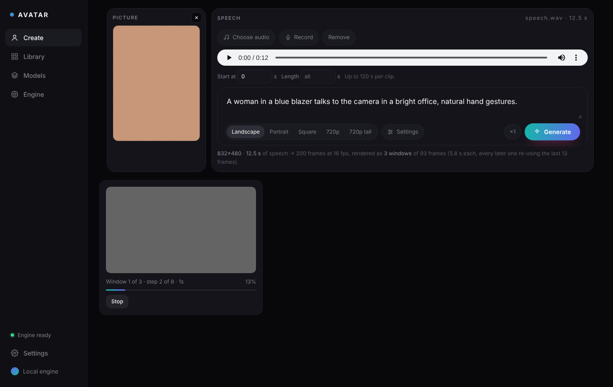

# LongCat Avatar Studio

A local front end for **LongCat-Avatar** in ComfyUI. Give it a picture of a
person and some speech, recorded in the browser or from a file. It gives
back a video of that person saying it, lips in sync. You can add a sentence
to steer the scene.

It follows the same pattern as the other studios in this account (see
`Text-to-Video-Model/minimax-studio`): a small Flask app, one HTML page, a
setup sheet, and Models and Engine pages. Generation runs on kijai's
[ComfyUI-WanVideoWrapper](https://github.com/kijai/ComfyUI-WanVideoWrapper),
following his official example workflow (copied to `assets/`).



---

## Read this before you download 42 GB

LongCat-Avatar is a 13.6-billion-parameter video model, published in bf16
only. The weights are the floor:

| File | Folder | Size |
|---|---|---|
| `LongCat-Avatar_comfy_bf16.safetensors` | `diffusion_models` | ≈ 28 GB |
| `umt5-xxl-enc-bf16.safetensors` (text encoder) | `text_encoders` | ≈ 11.4 GB |
| `LongCat_distill_lora_alpha64_bf16.safetensors` | `loras` | ≈ 1.4 GB |
| `MelBandRoformer_fp32.safetensors` (voice isolation, optional) | `diffusion_models` | ≈ 0.9 GB |
| `Wan2_1_VAE_bf16.safetensors` | `vae` | ≈ 0.25 GB |
| `wav2vec2-chinese-base_fp16.safetensors` | `wav2vec2` | ≈ 0.2 GB |

The ≈ sizes are estimates until HuggingFace is asked; setup reads the real
ones before it downloads. Every link is in
[`../REFERENCE_LINKS.md`](../REFERENCE_LINKS.md).

**On an 8 GB card with 32 GB of RAM** the defaults aim to reduce memory use.
They do not establish that a complete render fits that hardware:

- **fp8 in memory.** The bf16 file is stored as fp8 as it loads: about
  14 GB for the DiT instead of 28. A cached DiT can coexist with the
  11 GB CPU text encoder on a later prompt. Allow additional RAM for the
  VAE, audio models, frames, loading copies and the operating system;
  32 GB is a tight starting point, not a guarantee.
- **Block swap 40 of 48.** Most of the DiT stays in system RAM and visits
  the GPU a block at a time. Block prefetch defaults to zero, leaving more
  space for activations instead of keeping an extra block on the card.
- **umT5 on the GPU in fp8.** The 11 GB text encoder goes to the card as
  fp8, about 6.7 GB, while the DiT is still in RAM. It reads the prompt in
  seconds and is dropped straight after. The result is cached on disk, so
  the same prompt is never read twice. On the CPU it took **5½ minutes** on
  a real RTX 4060 PC, and that is now only the fallback. If the card is too
  full, the render retries on the CPU by itself.
- **Tiled VAE, 480p, the distill LoRA** (12 steps at cfg 1).

**There is no length limit worth the name — up to an hour per clip.** The
GPU never sees more than one 5.8-second window at a time, so 8 GB of VRAM
does the same work for a 10-second clip as for a 10-minute one. What grows
with length is the decoded frames in RAM, so a long clip is rendered in
**parts** of two windows (one at 720p), each its own ComfyUI job that carries
on from the last 13 frames of the part before. The parts are then joined
into one video a frame at a time, with the original soundtrack laid under it
in one piece. Measured on a real ComfyUI: a 5-minute clip (30 parts) peaked
within 1 GB of a 30-second one, and the joined files were exactly 4,800 and
480 frames with the speech to the millisecond. A clip's frames need about
3 GB of RAM at 480p whatever its length; time is the only thing that grows.

**Not timed end to end on a real 8 GB card yet.** Expect several minutes
per 5.8-second window at 480p. 720p has 2.3× the pixels and takes well over
twice as long, so on 8 GB start at 480p. The **Preflight** panel on the Engine page measures your VRAM, RAM
and free disk before anything downloads, and says what applies.

### CPU fallback repair

The upstream cached text encoder loaded T5 onto the GPU even with CPU
encoding selected. That made its out-of-memory fallback fail before CPU
encoding began. On engine start/restart, Avatar Studio repairs that specific
loader argument in `ComfyUI-WanVideoWrapper/nodes.py`, keeping a uniquely
named original beside it. Unfamiliar upstream code is left unchanged with
a console message. **Restart the engine after updating.** CPU fallback still
needs enough system RAM for the bf16 encoder; it is not a memory-free mode.
For a manually managed remote ComfyUI, apply the equivalent loader fix there
and restart it; this app cannot edit that machine's files.

---

## Running it

**Windows**: double-click `run.bat`. **Linux and macOS**: run `./run.sh`.
Both open <http://127.0.0.1:7808>.

The first launch opens the setup sheet. It offers three routes: use an
existing ComfyUI, install a fresh managed one, or connect to one you start
yourself. Then it does the following:

1. Finds Python 3.10+.
2. Installs ComfyUI (or uses yours).
3. Installs the node packs:
   - **ComfyUI-WanVideoWrapper**, required. The LongCat Avatar nodes were
     built on its `longcat_avatar` branch, and that branch is now merged
     into `main`, which is what gets installed. The branch zip in this repo
     (`../ComfyUI-WanVideoWrapper-longcat_avatar.zip`) is kept for
     reference.
   - **ComfyUI-KJNodes**, required. It resizes the picture and stitches
     the windows.
   - **ComfyUI-MelBandRoFormer**, optional. It isolates the voice.
   - **ComfyUI-Manager**, optional.
4. Installs PyTorch and the packs' requirements.
5. Downloads the weights, resumably, with one progress bar for the whole
   set.
6. Adds its wav2vec2 compatibility node to ComfyUI (see below).
7. Starts ComfyUI with `--lowvram --preview-method auto`.

### ComfyUI crashing mid-render on Windows

The wrapper's sampler draws a small chart with matplotlib on every run. On
Windows with Tk installed, matplotlib picked its Tk GUI backend, and ComfyUI
died partway through a render with `Tcl_AsyncDelete: async handler deleted
by the wrong thread`. The app now starts ComfyUI with `MPLBACKEND=Agg` (no
GUI), and its compatibility node does the same for a ComfyUI started some
other way. If the engine the app started does die during a render, the clip
fails at once and quotes the engine's last fatal line.

### The lip sync on transformers 5

From transformers 5.0, the wav2vec2 that the lip sync uses returns no
hidden states. Every render then stops at `MultiTalkWav2VecEmbeds: 'NoneType'
object is not subscriptable`. A fresh ComfyUI gets 5.x. The app copies a
small custom node of its own, `custom_nodes/avatar_studio_compat`, into
ComfyUI before every start. It puts the 4.x behaviour back, and its output
is identical to transformers 4.57.6. Nothing in ComfyUI's Python is
changed, so there is no downgrade to fail. Only if the node cannot be
written does the app install transformers 4.x instead. If neither works,
ComfyUI is not started and the Engine page says why.

---

## Making a clip

1. **Picture.** Click the card or drop a file. A face that is clearly
   visible works best. It is centre-cropped to the size you pick.
2. **Speech.** Choose an audio file, or a video whose soundtrack is used.
   Or press **Record** and talk. A recording is converted to WAV in the
   browser before it is uploaded. **Start at** and **Length** pick a
   stretch of a longer file. A clip can be up to an hour long.
3. **Prompt.** Describe the person and the scene. It steers motion,
   expression and setting; the lips follow the audio regardless.
4. **Size.** Landscape 832×480 (the workflow's own), Portrait 480×832,
   Square 640×640, or 720p either way (720p wants a 24 GB card).

The line under the prompt shows what will render: the frames, and how many
windows.

### How a long clip is made

LongCat-Avatar renders **93 frames at a time, at 16 fps** (5.8 s). Kijai's
workflow wires three windows by hand. This app builds as many as the speech
needs: `windows = 1 + ceil((frames − 93) / 80)`, grouped into parts of 2
windows (1 at 720p) so memory stays flat however long the speech is.

- The first window starts from the picture alone.
- Each later window continues from the last 13 frames of the one before.
  Those frames are decoded, re-encoded and written back into the seam
  (`ReplaceVideoLatentFrames`), so the join does not drift.
- The picture's latent anchors every window, so the face stays the
  person's.
- The windows are joined with `ImageBatchExtendWithOverlap` (cut), then
  trimmed back to the exact length of the speech.
- A long clip's parts are separate ComfyUI jobs. Part *k* loads part *k−1*'s
  video, re-encodes its last 13 frames as the start of its first window, and
  listens to its own slice of the speech. ComfyUI's cache keeps the model
  loaded from part to part. `assemble.py` joins the parts frame by frame
  with PyAV and adds the soundtrack in one piece.

The finished clip carries the **original** audio, music and all. Only the
lips listen to the isolated voice.

### Settings

| Setting | Default | Notes |
|---|---|---|
| Steps | 12 | Paired with the distill LoRA and the `longcat_distill_euler` scheduler. |
| Shift | 12 | The workflow's value. |
| Lip-sync strength | 2 | `audio_cfg_scale`. Above 1 adds a model pass per step. 3–5 is stronger lip sync, and slower. |
| Audio scale | 1.0 | Raise it if the mouth under-moves. |
| Distill LoRA | 1.0 | The alpha64 LoRA. The older rank-128 one hurts the window extension. |
| Block swap | 40 / 48 | Lower is faster on a bigger card (the workflow uses 25). |
| Weights in memory | fp8 | bf16 doubles the RAM needed. |
| Attention | sdpa | sageattention 1.0.6 does not work with LongCat. |
| Isolate the voice | on | MelBandRoFormer. Without it, background music moves the lips too. |
| Tiled VAE | on | Turn it off only on 16 GB+. |
| Text encoder on | GPU (fp8) | Seconds. CPU (bf16) took 5½ min on a real 4060 PC, and is used automatically if the GPU is too full. |

---

## Tests

```bash
python tests/run.py            # gate, units, graph, api, stress, ui (+ real)
python tests/run.py graph api  # just those
AVATAR_REAL_COMFY=http://127.0.0.1:8188 AVATAR_REAL_MODELS=/path/ComfyUI/models \
    python tests/run.py real   # against a real ComfyUI with the three packs
```

The historical [test report](docs/TEST_REPORT.md) records 314 passing checks
and an out-of-the-box ZIP run. For the current memory fixes, validation
results and remaining hardware limitations, see [MEMORY_AUDIT.md](../MEMORY_AUDIT.md).
See [docs/screenshots/](docs/screenshots/) for every screen.

`tests/object_info.json` is not guessed. It is the real `/object_info` of
ComfyUI 0.39 with the three node packs loaded, cut down to the nodes this
app uses. The mock ComfyUI validates prompts against it the way ComfyUI
does. A three-window graph built by `comfy.py` was also posted to a real
CPU-only ComfyUI with the packs installed, and it passed validation. The
`ui` test drives the page in Chromium, including a recording from a fake
microphone.

## Layout

```
server.py      Flask API: render jobs, gallery, uploads, preflight, setup
bootstrap.py   Discovery, installs, weight downloads, preflight, ComfyUI process
manager.py     Dependency checks and installers, HuggingFace browsing
comfy.py       Builds the LongCat Avatar graph from ComfyUI's live schema
web/index.html The interface: one file, no build step
assets/        kijai's example workflow this follows, and a screenshot
tests/         python tests/run.py: the suite, against a mock ComfyUI
data/          config.json, gallery.json, clips/
```

`AVATAR_REHEARSAL=1` (tests only) swaps the diffusion for stand-in frames,
so the whole app — parts, joins, assembly — can run on an engine without the
model.

`AVATAR_COMFY_ARGS` adds flags to the ComfyUI the app starts, e.g.
`--use-sage-attention`. A memory mode (`--cpu`, `--highvram`, `--novram`)
replaces the app's `--lowvram`, since ComfyUI takes only one.

Port: `AVATAR_STUDIO_PORT` (default 7808). `AVATAR_STUDIO_NO_BROWSER=1`
stops it opening a tab. `AVATAR_STUDIO_DATA` moves the data folder.
